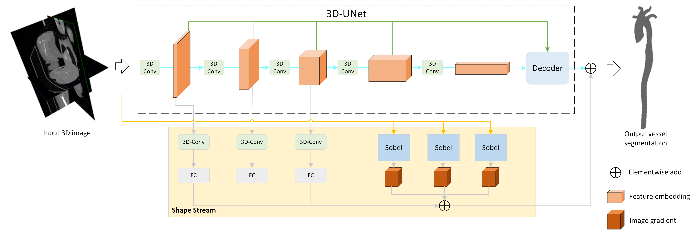
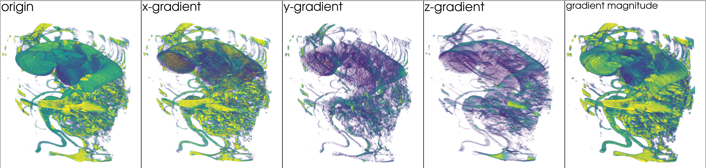
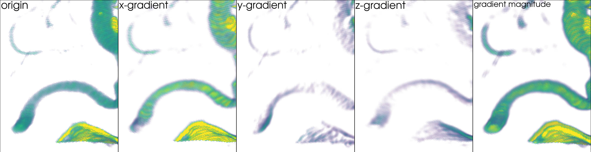
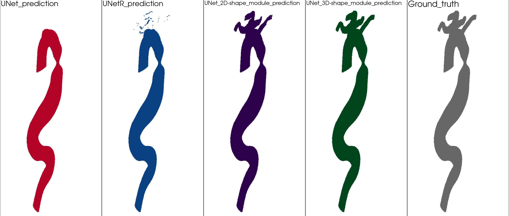
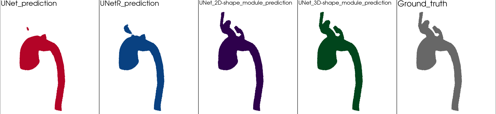
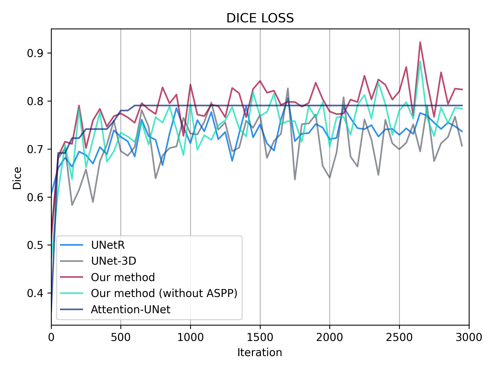

# Aorta_Segmentation
---
## Introduction
> Vascular segmentation plays an essential role in medical images. The volume of vessels from medical images can be used to reconstruct the 3D mesh of blood vessels, and the 3D mesh of blood vessels can be used for the simulation analysis of blood pressure and flow. In this project, we mainly focus on `aorta` vessels and use a semantic segmentation model based on `U-Net` and `image gradients` to segment the trunk and branches of vessels.
---
## Results
> Our method is based on the Unet-3D structure. Since Unet-3D cannot capture the small features of branch vessels, we add a shape stream module that use image gradients and feature maps of the Unet-3D's encoder. The model framework is as follows:

> We use 3D sobel filters to get the image gradients. From the results, image gradients can strengthen the tiny vessel, like branch vessels of the aorta.

> Here's the comparison between other segmentation models and our method:

